# Distributed Monitoring and Control System  

## 1. Overview  
IoT-based Smart Home solution using two independent ESP32 nodes communicating in real-time via MQTT. The system monitors environmental parameters (temperature, air quality, light) and automatically controls power loads (DC motor, LED) with hysteresis logic or manual override through a Node-RED dashboard.

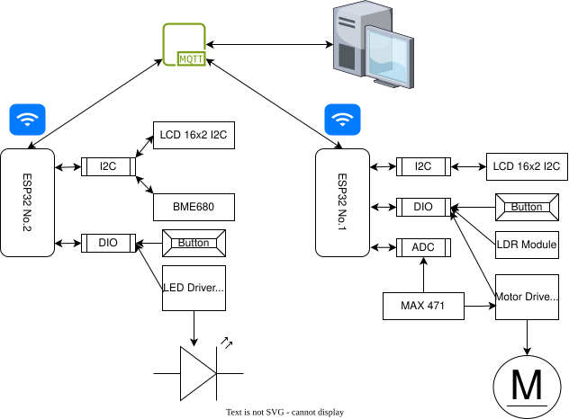  
*System block diagram showing sensor-actuator distribution and MQTT communication*

## 2. Hardware  
Node 1 handles power control and consumption monitoring. Node 2 performs environmental data acquisition and visual feedback.

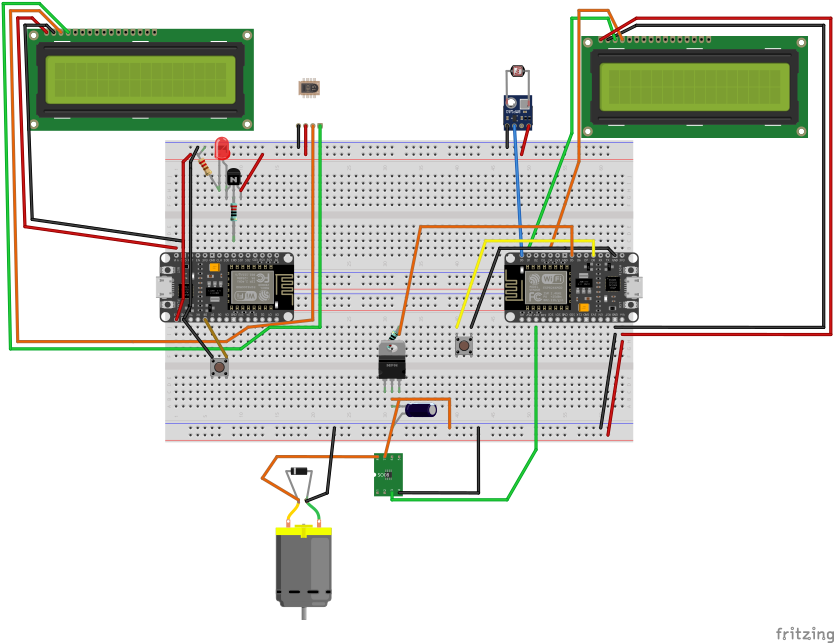  
*Full breadboard assembly of both nodes*

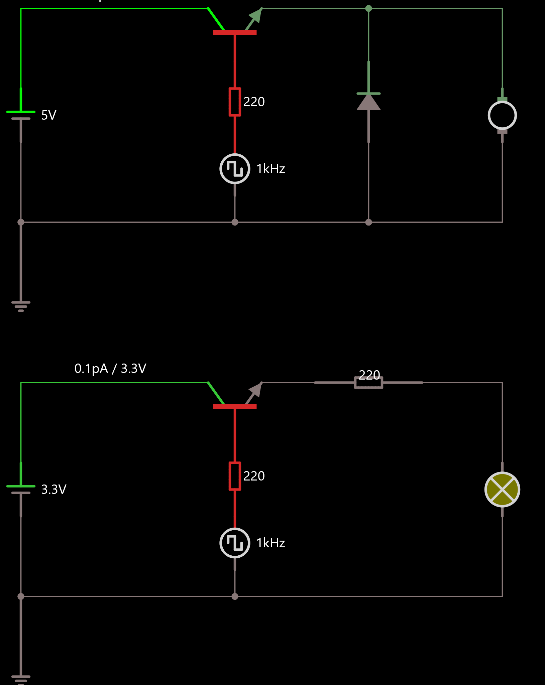  
*TIP142 Darlington transistor driver for DC motor with flyback diode protection; S8050 NPN transistor driver for LED control*

## 3.1 Software – ESP32 Nodes  

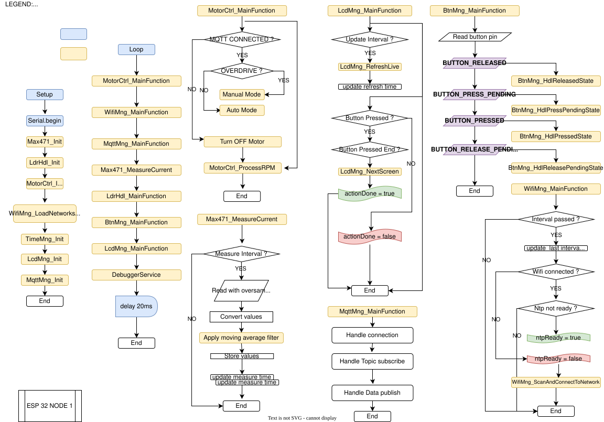  
*Software flow for Node 1 (motor control, MAX471, LDR, WiFi/MQTT, LCD, button FSM)*

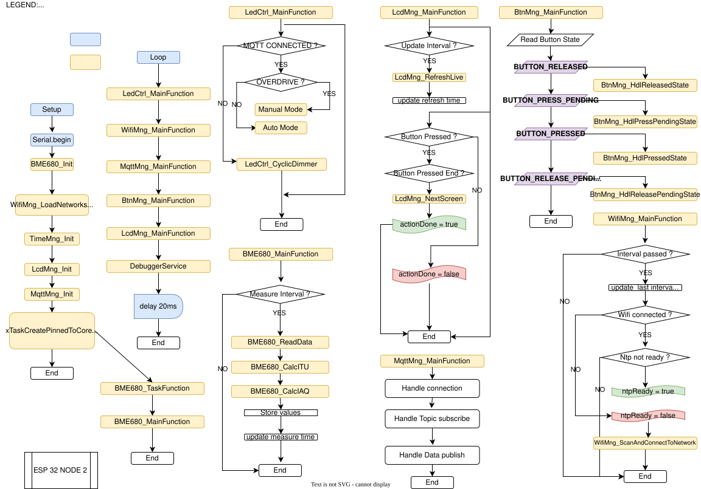  
*Software flow for Node 2 (BME680 task, LED dimmer, WiFi/MQTT, LCD, button FSM)*

## 3.2 MQTT & Node-RED Dashboard  

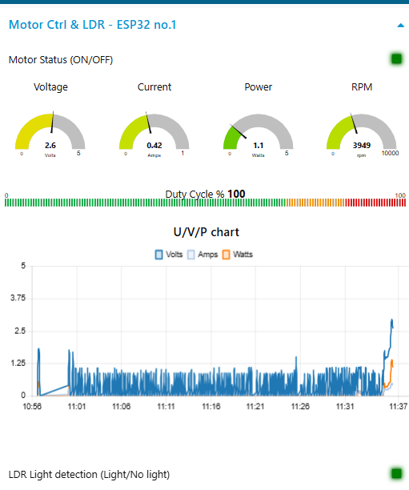  
*Real-time motor power, current, voltage and LDR status monitoring*

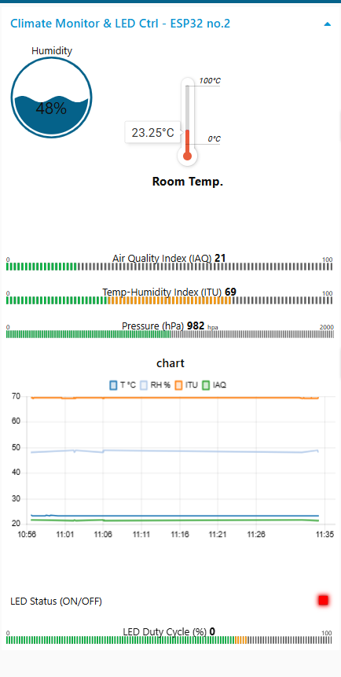  
*Temperature, humidity, IAQ and LED control visualization*

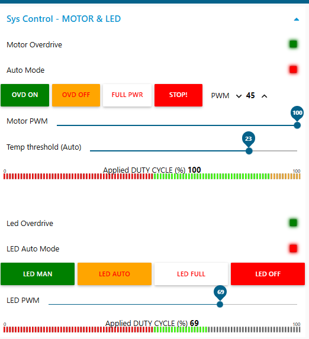  
*Manual/Auto mode selection and direct control buttons for motor and LED*

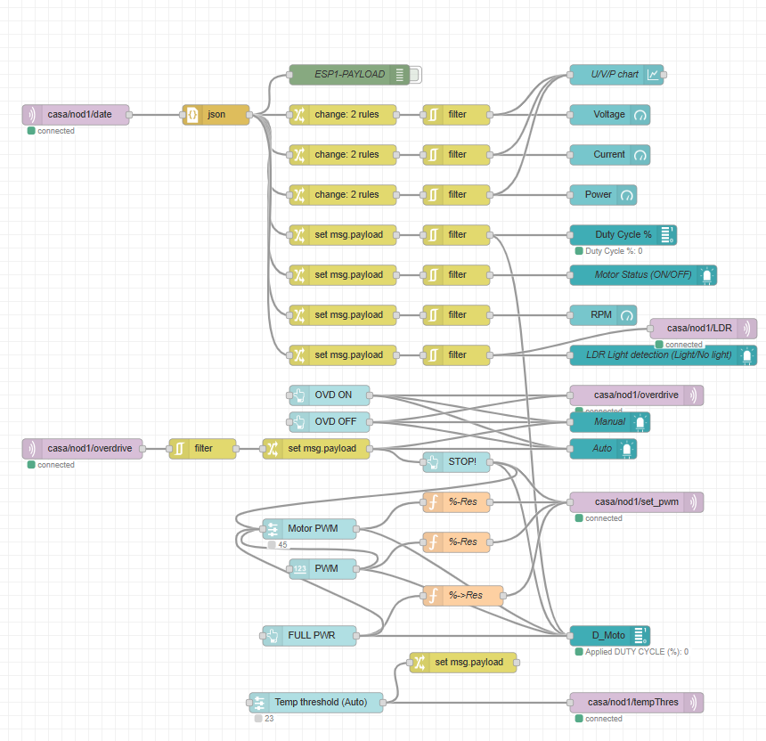  
*Data processing and dashboard flow for Node 1*

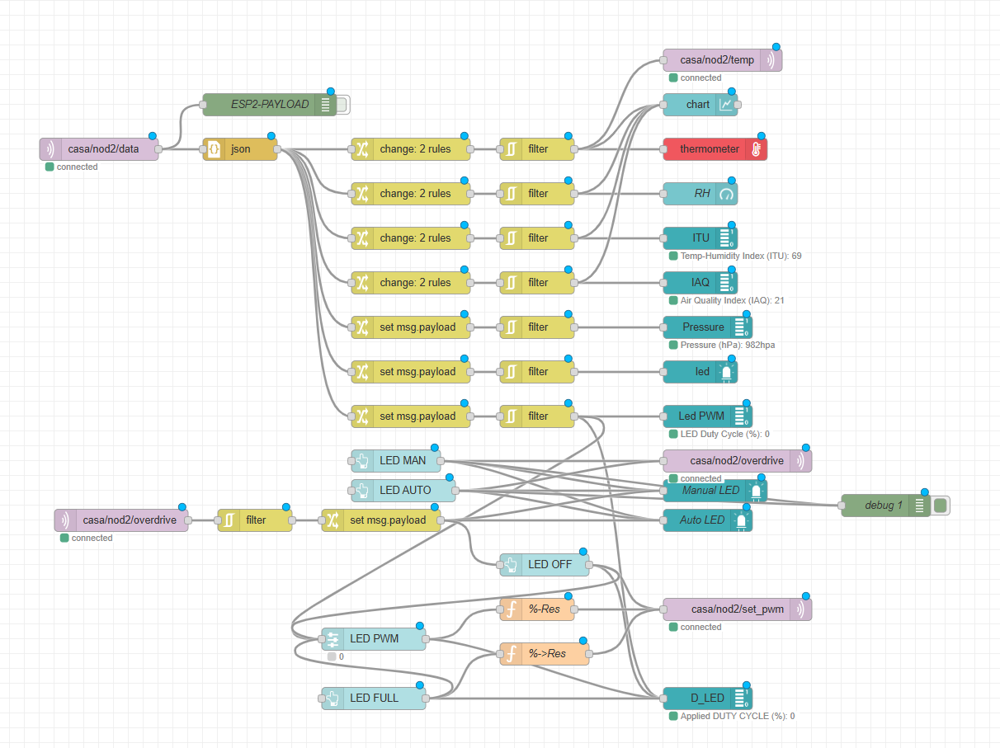  
*Sensor data processing and LED command flow for Node 2*

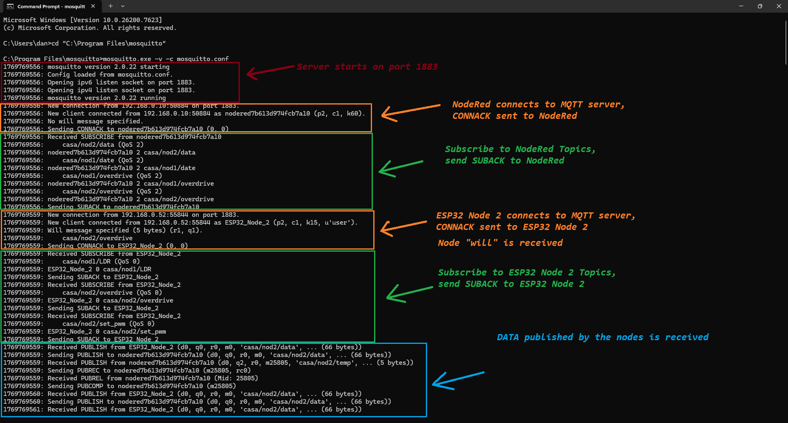  
*MQTT communication flow between ESP32 nodes and Node-RED dashboard*
